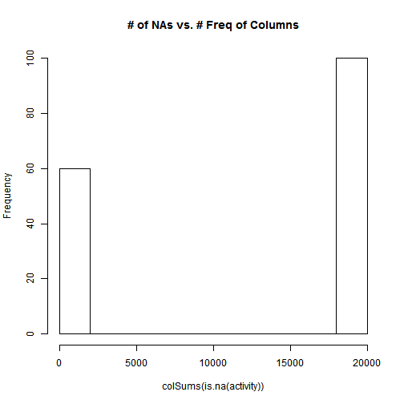
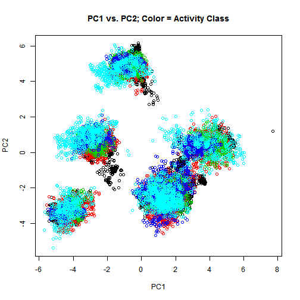
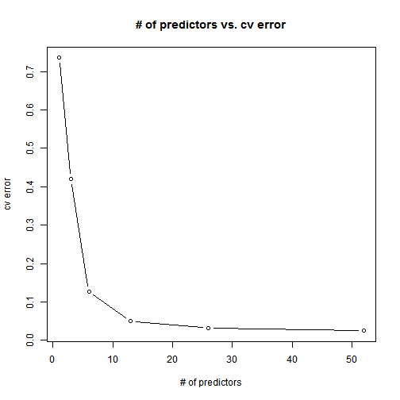

# Activity prediction from accelerometer data
   
## Farhan Siddiqui
   
## Friday, October 24, 2014
   

This paper explores the use of acceleromoter data from the belt, forearm, arm, and dumbell of 6 participants in order to predict barbell lifts correctly and incorrectly in 5 different ways. More information is available from the website here: http://groupware.les.inf.puc-rio.br/har (see the section on the Weight Lifting Exercise Dataset). 

The training data for this project are available here: 

https://d396qusza40orc.cloudfront.net/predmachlearn/pml-training.csv

The test data are available here: 

https://d396qusza40orc.cloudfront.net/predmachlearn/pml-testing.csv


```r
#read data
set.seed(1234)
setwd("~/R/PracticalML/Project")
activity <- read.csv(file="pml-training.csv",head=TRUE,sep=",", na.strings=c("NA", "#DIV/0!"))
```

We first explore the training dataset provided


```r
str(activity)
```
Structure command reveals that a large number of columns have lots of NAs. We now visualize the number of NAs graphically.

```r
hist(colSums(is.na(activity)), main="# of NAs vs. # Freq of Columns")
```

 
<br>
As can be seen from the histogram, about 100 columns have mostly NAs in the data set. To reduce the dimensionality of the data, we will now exclude any columns which have more than 95% NAs in the data as the information content of such columns is extremely low and they would not add much to prediction accuracy.


```r
activity <- activity[,colSums(is.na(activity))< 0.95*nrow(activity)]
```
We are still left with 59 predictors and 1 response varibale in the dataset. We will now use PCA to further reduce the number of predictors. We exclude first 7 predictors as they are indexes, names and dates that should not have any precitive value.


```r
library(caret)
inTrain <- createDataPartition(y=activity$classe, p=0.7, list=FALSE)
training <- activity[inTrain,]
testing <- activity[-inTrain,]
pr <-prcomp(training[,-c(1:7,60)], center=T, scale=T)
```

```r
print(paste("Number of Principal Components : ",length(pr$sdev)))
```

```
## [1] "Number of Principal Components :  52"
```

```r
plot(pr$x,col=training$classe,xlab='PC1',ylab='PC2',main="PC1 vs. PC2; Color = Activity Class")
```

 
Next we will use cross validation to explore how prediction error rate varies with # of predictors.


```r
trainPC=predict(pr,training[,-c(1:7,60)])
library(randomForest)
```

```r
cv <- rfcv(trainPC, training$classe)
cv$error
```

```
##         52         26         13          6          3          1 
## 0.02467788 0.03203028 0.05001092 0.12651962 0.42025187 0.73589576
```

```r
plot(cv$n.var,cv$error,type="b",xlab="# of predictors",ylab="cv error", main="# of predictors vs. cv error")
```

 
<br>
Since error rate continues to drop as we include more predictors and as we want our model to be as accurate as possible, we will use all of the principal components to train our model.

```r
modelFit <- randomForest(training$classe~ .,data=trainPC)
modelFit
```

```
## 
## Call:
##  randomForest(formula = training$classe ~ ., data = trainPC) 
##                Type of random forest: classification
##                      Number of trees: 500
## No. of variables tried at each split: 7
## 
##         OOB estimate of  error rate: 2.1%
## Confusion matrix:
##      A    B    C    D    E class.error
## A 3897    4    1    2    2 0.002304147
## B   57 2572   25    1    3 0.032355154
## C    3   32 2349   12    0 0.019616027
## D    5    1   97 2144    5 0.047957371
## E    0   12   19    7 2487 0.015049505
```
This gives us an OOB estimate of  error rate of about 2%

```r
testPC=predict(pr,testing[,-c(1:7,60)])
confusionMatrix(testing$classe,predict(modelFit,testPC))
```

```
## Confusion Matrix and Statistics
## 
##           Reference
## Prediction    A    B    C    D    E
##          A 1671    2    0    1    0
##          B   28 1100    7    2    2
##          C    0   10 1009    7    0
##          D    3    0   35  925    1
##          E    0    7    5    4 1066
## 
## Overall Statistics
##                                          
##                Accuracy : 0.9806         
##                  95% CI : (0.9768, 0.984)
##     No Information Rate : 0.2892         
##     P-Value [Acc > NIR] : < 2.2e-16      
##                                          
##                   Kappa : 0.9755         
##  Mcnemar's Test P-Value : NA             
## 
## Statistics by Class:
## 
##                      Class: A Class: B Class: C Class: D Class: E
## Sensitivity            0.9818   0.9830   0.9555   0.9851   0.9972
## Specificity            0.9993   0.9918   0.9965   0.9921   0.9967
## Pos Pred Value         0.9982   0.9658   0.9834   0.9595   0.9852
## Neg Pred Value         0.9926   0.9960   0.9903   0.9972   0.9994
## Prevalence             0.2892   0.1901   0.1794   0.1596   0.1816
## Detection Rate         0.2839   0.1869   0.1715   0.1572   0.1811
## Detection Prevalence   0.2845   0.1935   0.1743   0.1638   0.1839
## Balanced Accuracy      0.9905   0.9874   0.9760   0.9886   0.9969
```
As can be seen from the confusion matrix, we were able to precit over 98% of our test data set activity label correctly. Now that we have confidence in our model, we will use it to predict 20 test cases.

```r
testing <- read.csv(file="pml-testing.csv",head=TRUE,sep=",", na.strings=c("NA", "#DIV/0!"))
testPC=predict(pr,testing[,-c(1:7)])
answers = predict(modelFit,testPC)
answers
```

```
##  1  2  3  4  5  6  7  8  9 10 11 12 13 14 15 16 17 18 19 20 
##  B  A  B  A  A  E  D  B  A  A  B  C  B  A  E  E  A  B  B  B 
## Levels: A B C D E
```
Finally we will write each answer as a sperate text file in order to submit the solution.

```r
pml_write_files = function(x){
  n = length(x)
  for(i in 1:n){
    filename = paste0("problem_id_",i,".txt")
    write.table(x[i],file=filename,quote=FALSE,row.names=FALSE,col.names=FALSE)
  }
}

pml_write_files(answers)
```
